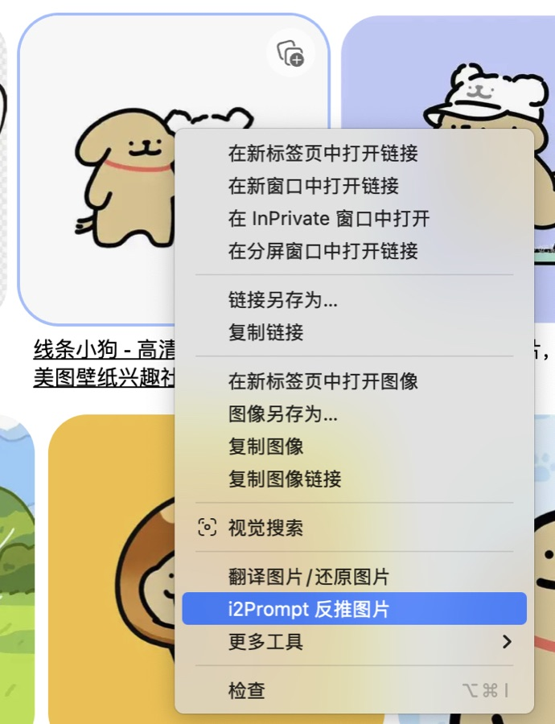
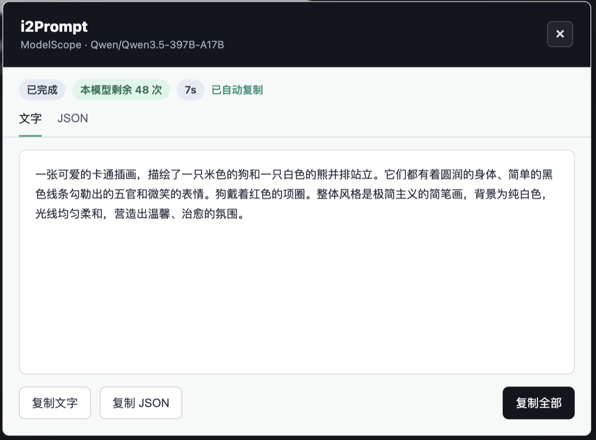
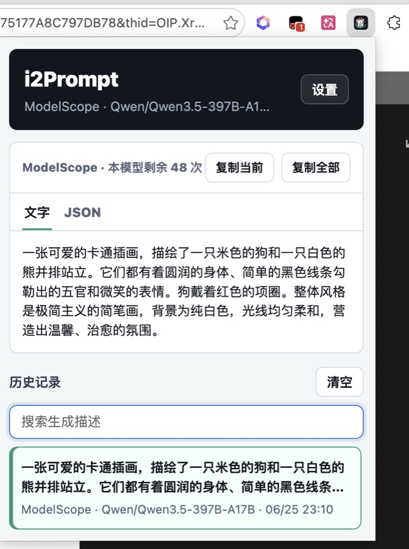
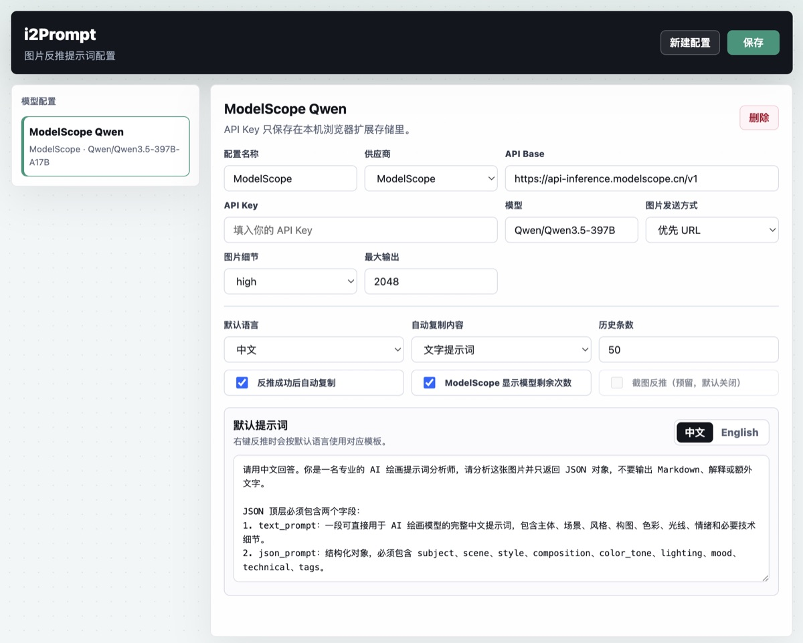

# i2Prompt

i2Prompt 是一个图片反推提示词工具。它支持 Edge / Chrome 扩展和 Tampermonkey 油猴脚本，在网页图片上右键即可调用多模态模型生成 AI 绘画提示词，并自动复制结果。

## 直接使用

仓库已提交构建产物，不会配置 Node.js / npm 也可以直接用。

- Edge / Chrome 扩展：下载仓库后加载 `dist/extension/`
- 油猴脚本：安装 `dist/i2prompt.user.js`

## 界面预览

| 右键反推 | 结果浮层 |
| --- | --- |
|  |  |

| 弹窗历史 | 设置页 |
| --- | --- |
|  |  |

## 功能

- 网页图片右键：`i2Prompt 反推图片`
- 自动生成 `text_prompt` 和 `json_prompt`
- 默认自动复制文字提示词
- 弹窗支持文字 / JSON 切换、复制当前、复制全部、清空历史
- 历史记录支持按生成描述搜索，高亮命中内容
- ModelScope 支持显示当前模型剩余次数
- 设置页可通过 `/models` 接口获取模型列表
- 支持自定义中文 / 英文默认提示词
- 第一版不做截图反推，避免和已有截图插件冲突

## 支持接口

- ModelScope，默认模型：`Qwen/Qwen3.5-397B-A17B`
- OpenAI Chat Completions
- OpenAI Responses
- Anthropic Claude Messages
- Google Gemini
- 硅基流动
- 其他 OpenAI 兼容多模态接口

ModelScope 有免费体验额度，适合先低成本试用。它的服务端需要能访问图片链接，国内可访问图片通常更稳，国外图片链接可能因为网络原因抓取失败。

## Edge 安装

1. 下载本仓库
2. 打开 `edge://extensions`
3. 开启“开发人员模式”
4. 点击“加载解压缩的扩展”
5. 选择 `dist/extension/`

如果图标或代码没有刷新，在 `edge://extensions` 找到 i2Prompt，点击“重新加载”。如果仍不刷新，先移除旧扩展，再重新加载 `dist/extension/`。

## Chrome 安装

1. 下载本仓库
2. 打开 `chrome://extensions`
3. 开启“开发者模式”
4. 点击“加载已解压的扩展程序”
5. 选择 `dist/extension/`

## Tampermonkey 安装

1. 打开 `dist/i2prompt.user.js`
2. 将内容复制到 Tampermonkey 新脚本
3. 保存并启用

油猴版使用页面内右键菜单，不是浏览器原生右键菜单。

## 使用

1. 打开扩展设置页
2. 选择供应商
3. 填入 API Key
4. 点击模型区域或“刷新模型”获取模型列表
5. 保存配置
6. 在网页图片上右键，点击 `i2Prompt 反推图片`

## 开发

需要修改源码时再使用 npm。

```bash
npm install
npm run build
npm run check
```

构建输出：

- `dist/extension/`：Edge / Chrome 扩展目录
- `dist/i2prompt.user.js`：Tampermonkey 油猴脚本

## 项目结构

```text
i2Prompt/
  src/shared/              通用提示词、模型配置、请求适配、响应解析
  src/extension/           Edge / Chrome 扩展源码
  src/userscript/          Tampermonkey 源码
  scripts/build.mjs        构建脚本
  dist/                    可直接使用的构建产物
```

## 隐私说明

- API Key 只保存在本机浏览器扩展存储或 Tampermonkey 本地存储
- 项目源码不会写入任何真实 API Key
- 历史记录只保存在本机
- 不上传图片到项目服务器；图片会按你选择的模型接口发送给对应服务商

## 许可证

本项目使用 [MIT License](LICENSE)。
